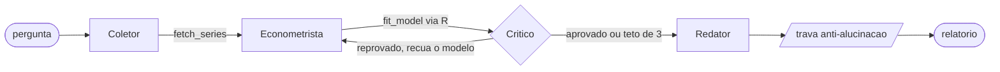

# Analista de Commodities Multiagente

Quatro agentes respondem a uma pergunta sobre preco de milho ou soja com um
relatorio em tres camadas: previsao, drivers e implicacao de decisao. A
econometria (MSGARCH/GARCH/ARIMA, diagnostico de residuo, backtest) roda em
R; os agentes vivem em Python, conversam com um LLM e nao sabem econometria
sozinhos -- decidem qual funcao do nucleo chamar e quando recuar de modelo.

**Resultado:** veja [examples/milho.md](examples/milho.md) e
[examples/soja.md](examples/soja.md) -- relatorios gerados pelo proprio
sistema (`run.py --fake-llm`, cache congelado, sem chamada de API), com o
modelo que passou (ou nao) no crivo do Critico e o backtest que ilustra a
leitura -- **uma** janela de origem fixa com 20 pontos, sem rolling origin.
Sem chave de API o corpo analitico desses dois relatorios e texto fixo de
demonstracao, escrito a mao para nao citar digito nenhum; o que o sistema
de fato calculou esta nas secoes deterministicas (recuo de modelo,
volatilidade, testes de residuo e backtest).

## Como funciona

| Agente | Decide |
|---|---|
| Coletor | quais series a pergunta exige, e com que janela |
| Econometrista | qual familia de modelo tentar |
| Critico | se o ajuste presta -- e **reprova, com motivo** (nao usa LLM) |
| Redator | como contar, em tres camadas -- sob a trava anti-alucinacao |



O laco vive entre Econometrista e Critico: reprovado, o modelo recua na
escada `msgarch -> garch -> arima`, ate passar ou estourar o teto de 3
tentativas. O Critico nao "acha" que o ajuste esta bom: ele roda os testes
abaixo e reprova com motivo escrito, sempre.

**O relatorio declara o recuo sempre que houve reprovacao**, e nao so quando
o teto estoura: a secao "## Recuo de modelo" lista cada tentativa reprovada
com a familia tentada e o motivo. Nos dois exemplos publicados e o que
mostra que o MSGARCH -- o modelo-assinatura do projeto -- foi tentado
primeiro e por que ele caiu; sem essa secao, "Tentativas: 2" nao dizia nem
que ele existiu. Quando o teto **tambem** estoura, entra ainda um aviso
explicito: o texto final traz o ultimo ajuste tentado, sem nenhuma
comparacao de AIC ou verossimilhanca entre as tentativas, e deve ser lido
com reserva.

### Diagnostico de residuo: o que faz o Critico checar premissa de verdade

Alem de convergencia, AIC finito e magnitude de parametro, o Critico
(`agro.models.diagnose`) roda dois testes classicos sobre o residuo do
ajuste, ao nivel de significancia de 5%:

- **Ljung-Box** -- autocorrelacao remanescente no residuo. P-valor abaixo do
  limiar significa que o modelo nao capturou toda a estrutura temporal da
  serie.
- **ARCH-LM** -- heterocedasticidade nao capturada. P-valor abaixo do limiar
  significa que ainda ha agrupamento de volatilidade que o modelo deixou
  passar.

A **ausencia** de um p-valor (o R nao devolveu, por exemplo porque o ajuste
nao convergiu) reprova por um motivo *diferente* e explicito -- ausencia de
informacao nao e a mesma coisa que confirmar que a premissa foi violada, e
misturar os dois enganaria quem le o relatorio. Os dois testes aparecem na
secao "## Testes de residuo" do relatorio sempre que o R os devolveu.

### Modelo de volatilidade empata com o passeio aleatorio -- por construcao

MSGARCH e GARCH tem media zero na especificacao: a previsao de RETORNO e
zero em qualquer horizonte, por desenho, nao por falha do ajuste. Isso
empata o MAPE/RMSE do ponto previsto com o passeio aleatorio (o backtest
compara os dois lado a lado de proposito -- MAPE sem referencia nao diz se o
modelo presta). A contribuicao real de um modelo de volatilidade esta na
**largura do intervalo de confianca**, calculada a partir da volatilidade
condicional (`vol_atual`) que o modelo estimou, nao no valor pontual. O
campo `Backtest.nota` existe para que o relatorio nunca leia esse empate
como derrota: ele distingue por escrito "empatou por construcao" de "o
refit nao convergiu e caiu na referencia", que sao causas opostas para o
mesmo silencio.

**Ate onde essa banda vai, exatamente.** A largura e a volatilidade
condicional corrente escalada por raiz de `h`, nao a previsao de variancia
multi-passo do modelo: num GARCH a variancia h-passos-a-frente reverte a
media de longo prazo, e essa reversao **nao esta capturada** aqui. A
diferenca e material quando a volatilidade corrente esta longe da
estrutural -- nos exemplos publicados, 0.0121 contra 0.0173. Fechar a lacuna
exige `ugarchforecast`, o que mudaria a banda de todos os resultados ja
publicados; fica registrado, nao implementado (ver a docstring de
`agro.models.backtest`).

## A trava anti-alucinacao (e suas limitacoes)

As tres camadas do corpo ("Previsao", "Drivers" e "Implicacao de decisao")
sao escritas por um LLM, uma por campo do esquema do Redator; tudo o mais no
pipeline e deterministico. `agro.guard.verificar_numeros` varre todo numero
do texto do Redator e confere cada um contra os valores calculados pelo
nucleo (`RunResult.valores_rotulados()`); numero sem origem levanta
`NumeroInventado` (ou `NumeroAmbiguo`, quando um separador de milhar deixa
duas leituras possiveis) e interrompe a execucao -- **e melhor falhar alto
do que publicar um numero fabricado**. A chamada vive na primeira linha de
`report.render_report`, antes de montar qualquer coisa: pular a trava por
esquecimento deixou de ser possivel.

A tolerancia e pela **precisao escrita**, nao por epsilon fixo: um numero
com `k` casas decimais so passa se for arredondamento correto de algum valor
autorizado *nessa* precisao. Escrever mais casas passou a ser mais exigente,
nao menos.

Prometer mais do que a peca entrega e pior do que a limitacao, entao aqui
vai a limitacao por escrito (ver a docstring completa em `src/agro/guard.py`
para a lista inteira):

- **Proveniencia de digito, nao vinculo semantico.** A trava confere se o
  DIGITO existe em algum resultado do nucleo -- nao se a GRANDEZA a que o
  Redator o atribui e a mesma de onde ele veio. "o preco subiu 3%" passa se
  `backtest.rmse = 3.21` for o unico valor perto de 3, mesmo RMSE e "preco
  subiu X%" nao tendo relacao nenhuma entre si.
- **Inteiros curtos sao estruturalmente livres.** Todo numero escrito sem
  casa decimal herda a tolerancia larga de +-0.5 de qualquer valor
  autorizado -- com um `RunResult` realista isso libera da ordem de dez
  inteiros distintos que o Redator pode citar em qualquer contexto de prosa.
- **Nada impede trocar o rotulo.** "o RMSE do backtest foi 4.53" passa mesmo
  que 4.53 seja o MAPE, nao o RMSE.
- **Escopo e so numero.** A trava nao verifica direcao (alta vs. queda),
  unidade (R$ vs. USD) nem coerencia entre frases do mesmo corpo.

A trava fecha o canal do numero totalmente inventado -- a maioria das
alucinacoes reais. Ela nao fecha o digito real com significado trocado.

## Rodar

Requer Python 3.10+ e R 4.4+ com `MSGARCH`, `rugarch`, `forecast` e
`jsonlite`. O piso do Python e 3.10 porque o codigo usa `X | None` em
anotacao avaliada em tempo de execucao (PEP 604, em `dataclass` e em
assinatura de funcao) e genericos embutidos (`dict[str, float]`); nada aqui
depende de versao mais nova.

```bash
pip install -r requirements.txt

# demonstracao, sem chave de API e sem rede (usa o cache congelado em cache/)
python run.py --commodity milho --pergunta "o que move o preco?" --fake-llm

# execucao real
set ANTHROPIC_API_KEY=...
python run.py --commodity soja --pergunta "o que move o preco nos proximos 3 meses?"
```

`agro.config.rscript_path()` procura o Rscript em tres lugares, nesta ordem:

1. a variavel de ambiente `AGRO_RSCRIPT`, se definida -- ela e autoritativa:
   apontando para um caminho que nao existe, o erro sobe em vez de cair
   calado nos proximos passos;
2. `Rscript` ou `Rscript.exe` no PATH (`shutil.which`) -- o caso normal de
   Linux e macOS, e de Windows quando o instalador do R registrou o PATH;
3. o caminho padrao de instalacao no Windows
   (`C:\Program Files\R\R-4.4.1\bin\Rscript.exe`).

Nao achando em nenhum dos tres, levanta `FileNotFoundError` citando os tres.
No Windows o instalador do R nao registra o PATH por padrao, e a variavel
resolve:

```bash
set AGRO_RSCRIPT=C:\Program Files\R\R-4.4.1\bin\Rscript.exe
```

## O cache congelado

`cache/*.parquet` (e o `*_meta.json` irmao de cada um) sao **versionados de
proposito**. Isso e o que faz a suite inteira rodar sem rede e o grafico
publicado em `examples/` nao mudar sozinho quando o mercado se move. Para
atualizar a janela:

```bash
python scripts/congelar_cache.py
```

O script baixa do Yahoo Finance as series publicas de milho (`ZC=F`), soja
(`ZS=F`) e cambio (`BRL=X`) -- e a **unica** parte do projeto que precisa de
rede. O coletor do CEPEA (preco domestico) levanta `ConnectionError` de
proposito nesta versao; a troca de fonte fica registrada no `_meta.json` e
aparece no relatorio como um aviso ("Fonte trocada: CEPEA indisponivel
...") -- isso e esperado, nao e um erro do script.

## Dois motores de orquestracao, mesmo resultado

O sistema tem duas implementacoes da camada de agentes, e a troca e uma flag:

```bash
python run.py --commodity milho --pergunta "..." --fake-llm --engine manual     # padrao
python run.py --commodity milho --pergunta "..." --fake-llm --engine langgraph
```

- **`manual`** (`agents/orchestrator.py`) -- um laco `for` com `break` e um
  `try/except`. Nenhuma dependencia de framework.
- **`langgraph`** (`agents_langgraph/graph.py`) -- o mesmo pipeline como
  `StateGraph`: cinco nos, duas arestas condicionais, checkpointing com
  `MemorySaver`.

Os dois usam os **mesmos** quatro agentes e o **mesmo** nucleo em `agro/`. So
o controle de fluxo muda. `tests/test_paridade.py` roda os dois com a mesma
entrada e compara campo a campo -- incluindo o markdown final, que sai
identico byte a byte.

**O que o framework cobrou.** `MemorySaver` serializa o estado a cada no com
msgpack, e `pandas.Series` nao e serializavel: a primeira versao do grafo
quebrava com `TypeError: Type is not msgpack serializable`. A saida foi
manter so o `SeriesBundle` no estado e reler o parquet em cada no que precisa
da serie. Medido em execucao: **1 leitura de parquet no motor manual, 3 no
grafo**. Nesta escala o tempo total nao muda de forma perceptivel -- o
gargalo e o subprocess do R, nao o disco -- mas numa serie grande o custo
deixaria de ser irrelevante.

**O que o framework comprou.** O estado do pipeline deixa de ser implicito em
variaveis locais e vira um `TypedDict` declarado; o laco de reprovacao vira
uma aresta condicional que se le sem seguir o fluxo mentalmente; e o
checkpointing permite inspecionar e retomar a execucao no meio, coisa que o
laco a mao nao oferece.

**O preco em codigo:** 54 linhas de codigo no orquestrador a mao contra 120
no grafo, para o mesmo comportamento.

`langgraph` e `langchain-core` estao em `requirements.txt` mas **so** o motor
`langgraph` e o teste de paridade dependem deles -- o import e adiado, entao
quem usar o motor padrao nao precisa te-los instalados.

## Testes

```bash
python -m pytest -v
```

**A suite precisa do R instalado, com os mesmos pacotes que o projeto usa em
producao.** Nao ha `skipif`: varios testes (`tests/test_rbridge.py`, parte de
`tests/test_models.py` e `tests/test_smoke.py`) chamam o R de verdade por
subprocess, porque e a fronteira Python-R que eles existem para provar. Sem o
R, ou sem os pacotes, a suite cai inteira -- e a causa nao aparece sozinha.
Para instalar os pacotes que `r/fit_model.R` carrega:

```r
install.packages(c("jsonlite", "MSGARCH", "rugarch", "forecast"))
```

Nenhum teste toca a rede ou gasta credito de API: o cache em `cache/` e
versionado e o LLM e substituido por um fake (`agents.llm.LLMFake`, ou o
roteador por prompt que `run.py --fake-llm` usa por baixo). O teste de fumaca
(`tests/test_smoke.py`) sobe o processo `run.py` de ponta a ponta para milho
e soja e confere que o cache existe e que o relatorio sai com as secoes
esperadas.

## Dados

Yahoo Finance (CBOT e cambio) e CEPEA (preco domestico, nao implementado
nesta versao -- ver secao do cache acima). Series publicas, nenhum dado de
cliente.
