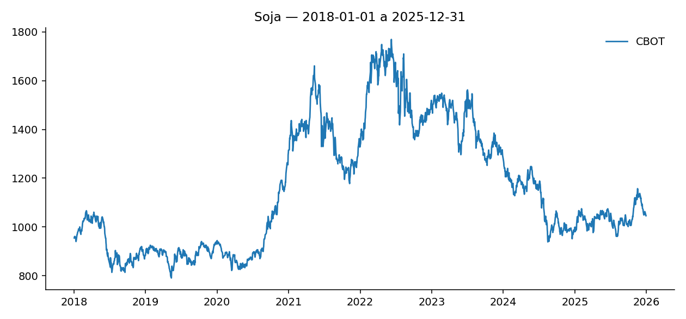

# Soja — analise quantitativa

**Pergunta:** o que move o preco da soja?

Serie de 2018-01-01 a 2025-12-31, 2009 observacoes. Modelo: garch. Tentativas: 2.

## Recuo de modelo

O Critico reprovou as tentativas abaixo antes do ajuste que o relatorio descreve. Cada linha traz a familia tentada e o motivo escrito da reprovacao.

1. **msgarch** — ARCH-LM rejeita homocedasticidade dos residuos (p=0.0242 < 0.05): ha heterocedasticidade nao capturada pelo modelo

> **Fonte trocada:** CEPEA indisponivel (coleta CEPEA nao implementada nesta versao); relatorio segue so com a serie internacional

## Previsao

Modo de demonstracao (--fake-llm): este texto e uma resposta fixa, nao uma chamada real ao modelo de linguagem -- por isso ele nao cita nenhum numero alem do que o nucleo ja calculou, exatamente como a trava anti-alucinacao exige de uma resposta de verdade. Modelos de volatilidade (MSGARCH, GARCH) tem media zero na especificacao, entao o ponto previsto empata com o passeio aleatorio por construcao; a contribuicao real deles esta na largura do intervalo do backtest, nao no valor pontual. Quando a escada recua ate o ARIMA, o modelo passa a produzir previsao pontual de verdade, ao custo de nao capturar mudanca de regime de volatilidade.

## Drivers

O preco de Soja no CBOT e a serie principal deste ajuste; o cambio USD/BRL entra como referencia para quem converte a serie internacional em preco domestico -- sem ele, analise de preco domestico de grao no Brasil esta errada. O CEPEA nao esta disponivel nesta versao, e o aviso de troca de fonte acima do grafico documenta isso. As secoes deterministicas abaixo trazem o que o modelo de fato estimou: volatilidade, testes de residuo e backtest.

## Implicacao de decisao

A decisao de manter, reduzir ou ampliar exposicao cabe a quem le o relatorio: este texto informa, nao recomenda. O que o sistema oferece para essa decisao e o alcance do modelo que passou no Critico, o motivo escrito de cada familia reprovada antes dele e a largura do intervalo medida no backtest -- e nao uma projecao de preco, que nenhuma das familias de volatilidade produz.

## Volatilidade

Volatilidade estrutural de longo prazo: 0.0133.
Volatilidade condicional do ultimo instante: 0.0096.

## Testes de residuo

Ljung-Box (autocorrelacao remanescente): p-valor 0.4601.
ARCH-LM (heterocedasticidade nao capturada): p-valor 0.1836.

## Backtest

Horizonte de 20 passos. Modelo: MAPE 4.87%, RMSE 57.5548. Passeio aleatorio: MAPE 4.87%, RMSE 57.5548. Cobertura do intervalo de 95%: 1.00 (20 pontos, resolucao 0.05). Em resumo, o modelo previu zero por construcao (media zero na especificacao) e empatou com o passeio aleatorio no ponto.
